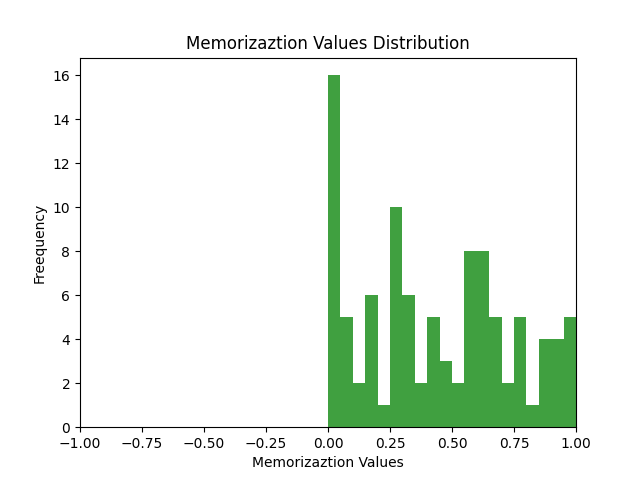
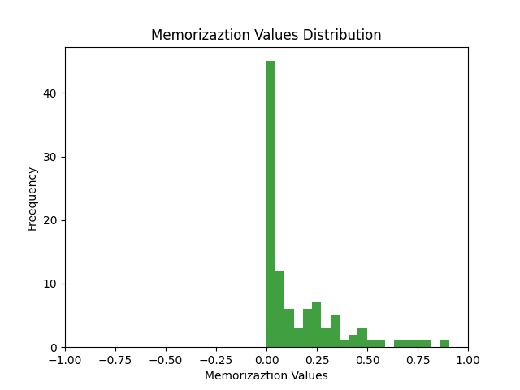
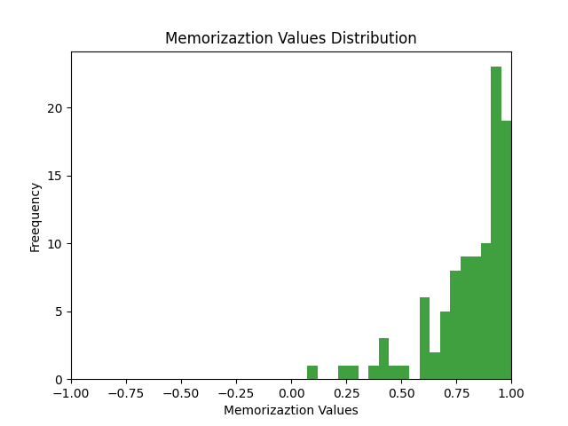
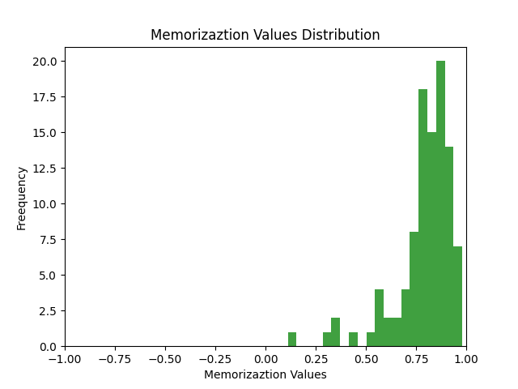

# Memorization & Influence Estimation In Neural Networks
Discovering the Long Tail via Influence Estimation.

The MNIST-1D dataset is obtained using the code in https://colab.research.google.com/github/greydanus/mnist1d/blob/master/building_mnist1d.ipynb (Links to an external site.) , it is assigned to a variable named data. 

Using the estimators described in Algorithm 1 of https://arxiv.org/pdf/2008.03703.pdf (Links to an external site.) for the models ConvBase and MLPBase, I will compute memorization estimates for each training data point (influence of each training point on each testing point is commented out in the code, but is still there). 

Memorization values are plotted as histograms for each model type.

## MLP model memorization values histogram (Original Dataset)

## ConvBase model memorization values histogram (Original Dataset)

## Conclusions

We can notice that ConvBase used much smaller memorization valuess, which makes it more effective algorithm when it comes to MNIST-1D dataset.

## Dataset Modification

I constructed a different MNIST-1D dataset by changing some of the dataset arguments such as corr_noise_scale, iid_noise_scale, and max_translation in order to get a dataset that will cause an increase in examples of high memorization examples. 

Finally, new memorization values are computed and saved as histograms. 

## MLP model memorization values histogram (Modified Dataset)

## ConvBase model memorization values histogram (Modified Dataset)

## Conclusions

ConvBase model remained more effective than the MLP model.

